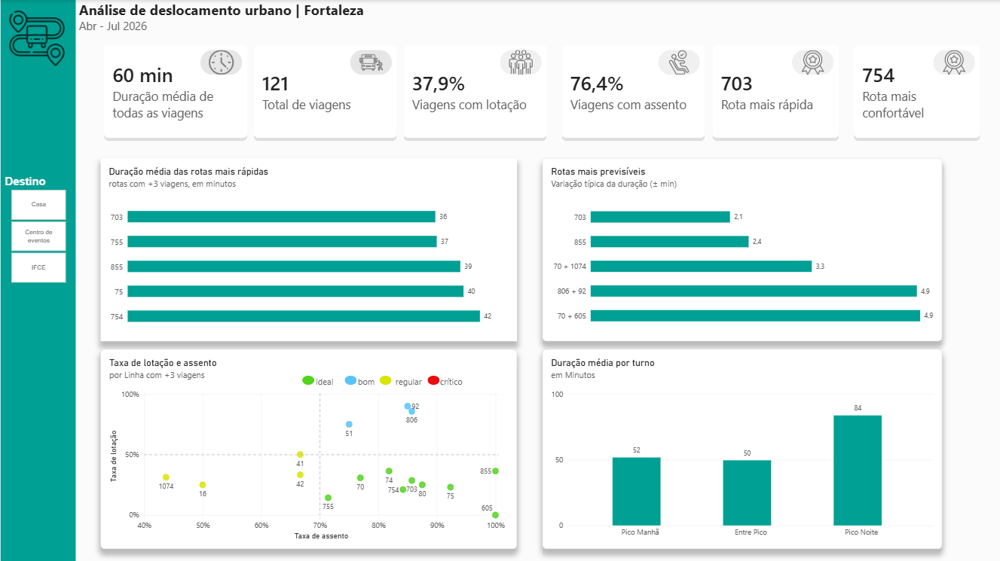
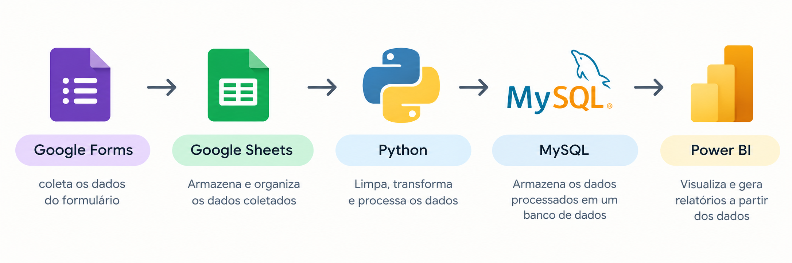
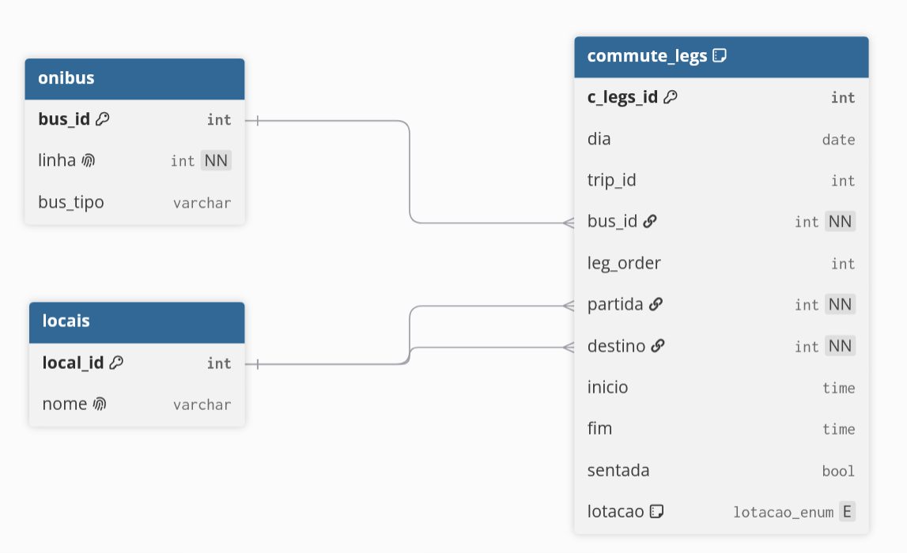
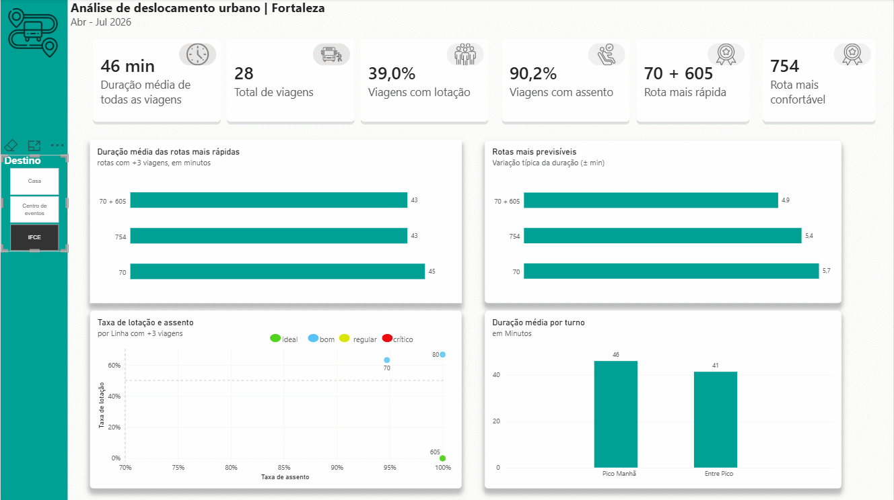

# Análise de deslocamento urbano | Fortaleza

Projeto pessoal de análise de dados sobre deslocamentos de ônibus em Fortaleza. Desenvolvido com Python, MySQL e Power BI para responder a uma pergunta simples: **qual ônibus eu devo pegar?**



## Motivação

A ideia surgiu da minha experiência com deslocamentos pela cidade e da percepção de que diferentes rotas podem apresentar grande variação no tempo de chegada. O projeto busca comparar rotas não apenas pela duração, mas também por **conforto e previsibilidade**.

## Principais resultados

* No dashboard com **Casa** selecionado, as rotas **806 + 92** e **51 + 92** estão entre as alternativas mais relevantes para o trajeto Centro de Eventos → Casa, enquanto **1074 + 754** apresenta resultados menos favoráveis.
* A rota **806 + 92** apresentou uma variação típica de aproximadamente **4,9 minutos**, sendo mais previsível que **51 + 92** (11,2 min) e **1074 + 754** (11,3 min).
* A rota **806 + 92** também apresentou taxa de assento superior a **70%**, enquanto **1074 + 754** apresentou valores inferiores.

## Como funciona



Os dados são coletados manualmente por meio de um formulário e armazenados no Google Sheets.
Python realiza a limpeza, validação e transformação dos dados.
As viagens são convertidas para o formato **uma linha por etapa**, permitindo diferentes quantidades de ônibus por viagem.
Os dados transformados são carregados em um modelo relacional no MySQL.
O Power BI é utilizado para análise e visualização, usando o **desvio-padrão da duração** como medida de previsibilidade e uma regra mínima de **3 viagens por rota** para comparação.



diagrama do banco de dados.


interação no dashboard.

<details>
<summary>Exemplo dos dados (ilustrativo, valores alterados; colunas omitidas)</summary>

### Dados brutos

| Data       | Ônibus 1 | Ônibus 2 | Partida           | Destino           | Início | Integração | Fim   | Tempo total | Sentada 1 | Sentada 2 | Lotação 1 | Lotação 2 | Dia da semana | Rota     |
| ---------- | -------: | -------: | ----------------- | ----------------- | ------ | ---------- | ----- | ----------: | --------- | --------- | --------- | --------- | ------------- | -------- |
|            |       80 |      755 | Casa              | Centro de eventos | 08:17  |            | 09:19 |          62 |           |           |           |           |               | 80 + 755 |
| 03/06/2026 |       80 |      703 | Casa              | Centro de eventos | 12:22  |            | 13:37 |          75 | Sim       |           |           |           | Quarta        | 80 + 703 |
| 04/06/2026 |       75 |          | IFCE              | Centro de eventos | 12:44  |            | 13:25 |          41 | Sim       |           | Baixa     |           | Quinta        | 75       |
| 13/06/2026 |       74 |       70 | Centro de eventos | Casa              | 13:14  |            | 14:23 |          69 | Sim       | Sim       | Baixa     | Baixa     | Sábado        | 74 + 70  |

### Dados limpos

| id | Data       | Ônibus 1 | Ônibus 2 | Partida           | Destino           | Início | Integração | Fim   | Tempo total | Sentada 1 | Sentada 2 | Lotação 1 | Lotação 2 | Dia da semana | Rota     |
| -: | ---------- | -------: | -------: | ----------------- | ----------------- | ------ | ---------- | ----- | ----------: | --------- | --------- | --------- | --------- | ------------- | -------- |
| 13 |            |       80 |    755.0 | Casa              | Centro de eventos | 08:17  |            | 09:19 |          62 |           |           |           |           |               | 80 + 755 |
| 15 | 2026-06-03 |       80 |    703.0 | Casa              | Centro de eventos | 12:22  |            | 13:37 |          75 | True      |           |           |           | Quarta        | 80 + 703 |
| 17 | 2026-06-04 |       75 |          | IFCE              | Centro de eventos | 12:44  |            | 13:25 |          41 | True      |           | Baixa     |           | Quinta        | 75       |
| 26 | 2026-06-13 |       74 |     70.0 | Centro de eventos | Casa              | 13:14  |            | 14:23 |          69 | True      | True      | Baixa     | Baixa     | Sábado        | 74 + 70  |

### Dados transformados

|  id | trip_id | leg | Data       | Destino           | Dia da semana | Fim   | Integração | Início | Partida           | Tempo total | Ônibus | Sentada | Lotação |
| --: | ------: | --: | ---------- | ----------------- | ------------- | ----- | ---------- | ------ | ----------------- | ----------: | -----: | ------- | ------- |
|  13 |      13 |   1 |            | Centro de eventos |               | 09:19 |            | 08:17  | Casa              |          62 |     80 |         |         |
| 134 |      13 |   2 |            | Centro de eventos |               | 09:19 |            | 08:17  | Casa              |          62 |    755 |         |         |
|  15 |      15 |   1 | 2026-06-03 | Centro de eventos | Quarta        | 13:37 |            | 12:22  | Casa              |          75 |     80 | True    |         |
| 136 |      15 |   2 | 2026-06-03 | Centro de eventos | Quarta        | 13:37 |            | 12:22  | Casa              |          75 |    703 |         |         |
|  17 |      17 |   1 | 2026-06-04 | Centro de eventos | Quinta        | 13:25 |            | 12:44  | IFCE              |          41 |     75 | True    | Baixa   |
|  24 |      26 |   1 | 2026-06-13 | Casa              | Sábado        | 14:23 |            | 13:14  | Centro de eventos |          69 |     74 | True    | Baixa   |
| 142 |      26 |   2 | 2026-06-13 | Casa              | Sábado        | 14:23 |            | 13:14  | Centro de eventos |          69 |     70 | True    | Baixa   |

</details>

## Como executar

Pré-requisitos: **Python 3** e **MySQL** em execução.

1. Clone o repositório e instale as dependências:

   ```bash
   pip install -r requirements.txt
   ```

2. Copie `.env.example` para `.env` e preencha as credenciais do MySQL.

3. Crie o banco e as tabelas:

   ```text
   sql/create_tables.sql
   ```

4. Crie a pasta `data/raw` e coloque o arquivo em:

   ```text
   data/raw/raw.csv
   ```

   O CSV deve conter as colunas usadas pelo script de limpeza. Os dados reais e o arquivo `.pbix` do Power BI não estão incluídos no repositório.

5. Execute os scripts na ordem:

   ```bash
   python scripts/01_clean_data.py
   python scripts/02_transform.py
   python scripts/03_load_to_mysql.py
   ```

6. Execute no MySQL:

   ```text
   sql/staging_to_model.sql
   ```

## Limitações

* A coleta cobre apenas o período de **abril a julho**, limitando o tamanho da amostra.
* Dos **121 registros**, 24 possuem horários ausentes ou inconsistentes; 23 não entram nos cálculos de duração e 1 é considerado com duração parcial.
* A análise poderia separar melhor as rotas para **dias úteis e sábados**.
* A coleta e o processamento ainda não são totalmente automatizados.
* Os resultados refletem uma **amostra pessoal de deslocamentos**, e não o comportamento geral do transporte público de Fortaleza.
